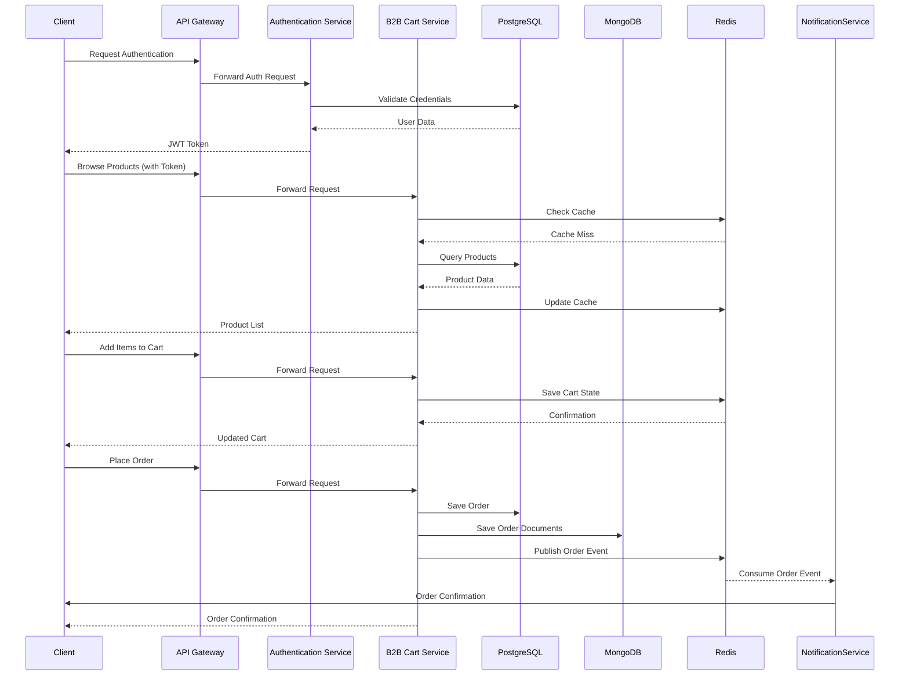

# B2B Shopping Cart Microservice Analysis

## Project Overview

This project is a B2B (Business-to-Business) shopping cart application built as a Spring Boot microservice designed to be deployed in Kubernetes (K8s). The application provides a robust backend for managing products, categories, users, orders, and authentication in a B2B e-commerce context. The application implements RESTful APIs for various business operations and leverages multiple technologies for persistence, caching, and security.

## Technology Stack

### Core Technologies
- **Java 8+** - Core programming language
- **Spring Boot 2.1.4** - Primary application framework
- **Spring Security OAuth2** - Authentication and authorization
- **Spring Data JPA** - Data access layer abstraction
- **Spring Data MongoDB** - Document-based NoSQL storage
- **Spring Data Redis** - Caching and messaging
- **PostgreSQL** - Primary relational database
- **MongoDB** - Document database for file storage and flexible data
- **Redis** - Cache and message broker
- **JWT (JSON Web Tokens)** - Secure token-based authentication
- **Swagger/OpenAPI** - API documentation
- **Docker** - Containerization
- **Kubernetes** - Container orchestration

### Key Dependencies
- **ModelMapper** - Simplifies object mapping between DTOs and entities
- **Lombok** - Reduces boilerplate code
- **Jackson** - JSON processing
- **Hibernate** - ORM implementation
- **Log4j2** - Logging
- **Sentry** - Error tracking
- **EasyRandom** - Test data generation

## Architecture

The application follows a layered architecture typical of Spring Boot applications, with clear separation of concerns:

1. **Controller Layer** - REST endpoints that handle HTTP requests/responses
2. **Service Layer** - Business logic implementation
3. **Repository Layer** - Data access interfaces
4. **Model Layer** - Domain objects/entities

The application also implements a generic CRUD pattern through base classes that most controllers and services extend, providing consistent API behavior and reducing duplicated code.

### Microservices Architecture Components

The application is designed as a microservice with the following characteristics:

1. **Stateless Design** - No session state is stored in the application
2. **API-First** - Well-defined REST APIs for all operations
3. **Externalized Configuration** - Environment variables for configuration
4. **Health Monitoring** - Actuator endpoints for health checks
5. **Docker Integration** - Containerized deployment
6. **Kubernetes Readiness** - Liveness/readiness probes, resource limits

### Database Schema

The main entities in the system include:

- **User** - Authentication and user information
- **Role** - User permissions
- **Item** - Products in the system
- **Category** - Product categorization
- **Invoice** - Order information
- **ItemsInvoices** - Order line items
- **State** - Workflow states for orders/items
- **FileStorage** - Files stored in MongoDB (GridFS)
- **FileItem** - Product images/attachments

## Security Implementation

The application implements OAuth2 with JWT tokens for authentication and authorization:

1. **JWT-Based Authentication** - Secure, stateless authentication
2. **Role-Based Authorization** - ADMIN and USER roles with different permissions
3. **Method-Level Security** - Secured annotations at service/controller level
4. **Password Encryption** - BCrypt password encoding
5. **CORS Configuration** - Secure cross-origin resource sharing

## Kubernetes Deployment Strategy

The application is designed for Kubernetes deployment with:

1. **Containerization** - Docker image building via Maven plugins
2. **Horizontal Pod Autoscaling** - Scale based on CPU usage
3. **Resource Limits** - Memory and CPU constraints
4. **Health Probes** - Liveness and readiness checks
5. **ConfigMaps** - Environment configuration
6. **Services** - LoadBalancer for external access
7. **Multi-Component Deployment** - Separate deployments for app, PostgreSQL, MongoDB, and Redis

### Deployment Components

1. **Backend Application (StatefulSet/Deployment)** - The Spring Boot application
2. **PostgreSQL (StatefulSet)** - Relational database with persistent volume
3. **MongoDB (StatefulSet)** - Document database with persistent volume
4. **Redis (StatefulSet)** - Cache and message broker
5. **Ingress** - External access configuration with TLS

## Key Features

1. **Authentication and Authorization** - OAuth2/JWT-based security
2. **Product Management** - CRUD operations for products/items
3. **Category Management** - Hierarchical product categorization
4. **Order Processing** - Invoice creation and management
5. **File Storage** - File upload/download using MongoDB GridFS
6. **Workflow Management** - State transitions with rules
7. **Caching** - Redis caching for performance
8. **Message Processing** - Redis pub/sub for asynchronous operations
9. **API Documentation** - Swagger UI

## Performance Considerations

1. **Redis Caching** - Configured for high-performance data access
2. **Connection Pooling** - Database connection optimization
3. **Pagination** - All list endpoints support pagination
4. **Compression** - HTTP response compression enabled
5. **Asynchronous Processing** - Message-based processing for non-critical operations
6. **Kubernetes Autoscaling** - Automatically scale based on load

## Monitoring and Observability

1. **Actuator Endpoints** - Health, metrics, and info endpoints
2. **Kubernetes Probes** - Liveness and readiness for health monitoring
3. **Sentry Integration** - Error tracking and reporting
4. **Logging** - Structured logging with Log4j2

## Testing Strategy

1. **Unit Tests** - Service and controller tests
2. **Integration Tests** - Repository and API tests
3. **Mock Testing** - Using Mockito and PowerMockito
4. **Test Data Generation** - Using EasyRandom
5. **Test Coverage** - Cobertura for coverage reporting

## Sequence Diagram: Order Processing Flow

## Development Workflow

The project uses GitHub Actions for CI/CD with the following flow:

1. Code Push to GitHub
2. Automated Testing
3. Docker Image Building
4. Docker Image Publishing
5. Kubernetes Deployment

## Recommendations for Improvement

1. **Microservices Decomposition** - Consider breaking into smaller, domain-focused services
2. **Event Sourcing** - Implement event sourcing for better auditability
3. **API Gateway** - Add an API gateway for routing and cross-cutting concerns
4. **Service Mesh** - Consider Istio for advanced networking features
5. **Distributed Tracing** - Add OpenTelemetry for request tracing
6. **Reactive Programming** - Consider Spring WebFlux for reactive APIs
7. **Schema Versioning** - Implement formal API versioning strategy
8. **Chaos Testing** - Implement resilience testing in Kubernetes

## Conclusion

This B2B shopping cart application demonstrates a well-structured Spring Boot microservice designed for Kubernetes deployment. It incorporates best practices in security, scalability, and cloud-native architecture, making it suitable for production deployment in a business e-commerce context.

The application leverages multiple persistence technologies (PostgreSQL, MongoDB, Redis) for their respective strengths, implements robust security with OAuth2/JWT, and includes comprehensive API documentation with Swagger. The Kubernetes deployment configuration ensures the application can scale horizontally based on demand and provides health monitoring for robust operations.
